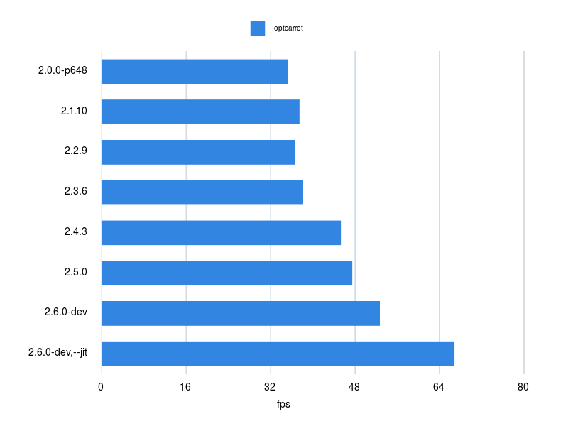

# BenchmarkDriver [](https://travis-ci.org/k0kubun/benchmark_driver)

Fully-featured accurate benchmark driver for Ruby

## Features
### Accurate Measurement

- Low overhead benchmark by running generated script instead of calling Proc
- Profiling memory and high-precision real time
- Running multiple times to minimize measurement errors

### Pluggable & Fully Featured

- Flexible and real-time output format in comparison, markdown table, graph, etc.
- Measuring various metrics by specifying runners
- Integrated benchmark support using external libraries
- Runner and output format are all pluggable

### Flexible Interface

- Ruby interface similar to stdlib benchmark.rb, benchmark-ips
- YAML input to easily manage structured benchmark set
- Comparing multiple Ruby binaries, even with miniruby

## Installation

```
$ gem install benchmark_driver
```

## Usage

### Ruby Interface

This interface generates code to profile with low overhead and executes it.

```rb
require 'benchmark_driver'

Benchmark.driver do |x|
  x.prelude <<~RUBY
    require 'active_support/all'
    array = []
  RUBY

  x.report 'blank?', %{ array.blank? }
  x.report 'empty?', %{ array.empty? }
end
```

or simply:

```rb
require 'benchmark_driver'

Benchmark.driver do |x|
  x.prelude <<~RUBY
    require 'active_support/all'
    array = []
  RUBY

  x.report %{ array.blank? }
  x.report %{ array.empty? }
end
```

### Structured YAML Input

With `benchmark-driver` command, you can describe benchmark with YAML input.

```
$ benchmark-driver -h
Usage: benchmark-driver [options] [YAML]
    -r, --runner [TYPE]              Specify runner type: ips, time, memory, once (default: ips)
    -o, --output [TYPE]              Specify output type: compare, simple, markdown, record (default: compare)
    -e, --executables [EXECS]        Ruby executables (e1::path1,arg1,...; e2::path2,arg2;...)
        --rbenv [VERSIONS]           Ruby executables in rbenv (x.x.x,arg1,...;y.y.y,arg2,...;...)
        --repeat-count [NUM]         Try benchmark NUM times and use the fastest result (TODO)
        --bundler                    Install and use gems specified in Gemfile
        --filter [REGEXP]            Filter out benchmarks with given regexp
        --verbose [LEVEL]            Show some verbose outputs: 0, 1, 2 (default: 0)
        --run-duration [SECONDS]     Warmup estimates loop_count to run for this duration (default: 3)
```

#### Running single script

With following `example_single.yml`,

```yml
prelude: |
  require 'erb'
  erb = ERB.new(%q[Hello <%= 'World' %>])
benchmark: erb.result
```

you can benchmark the script with multiple ruby executables.

```
$ benchmark-driver example_single.yml --rbenv '2.4.1;2.5.0'
Warming up --------------------------------------
          erb.result    71.683k i/s
Calculating -------------------------------------
                          2.4.1       2.5.0
          erb.result    72.387k     75.046k i/s -    215.049k times in 2.970833s 2.865581s

Comparison:
                       erb.result
               2.5.0:     75045.5 i/s
               2.4.1:     72386.8 i/s - 1.04x  slower
```

#### Running multiple scripts

One YAML file can contain multiple benchmark scripts.
With following `example_multi.yml`,

```yml
prelude: |
  a = 'a' * 100
  b = 'b' * 100
benchmark:
  join: '[a, b].join'
  str-interp: '"#{a}#{b}"'
```

you can benchmark the scripts with multiple ruby executables.

```
$ benchmark-driver example_multi.yml --rbenv '2.4.1;2.5.0'
Warming up --------------------------------------
                join     2.509M i/s
          str-interp     1.772M i/s
Calculating -------------------------------------
                          2.4.1       2.5.0
                join     2.661M      2.863M i/s -      7.527M times in 2.828771s 2.629191s
          str-interp     1.890M      3.258M i/s -      5.315M times in 2.812240s 1.630997s

Comparison:
                             join
               2.5.0:   2862755.1 i/s
               2.4.1:   2660777.4 i/s - 1.08x  slower

                       str-interp
               2.5.0:   3258489.7 i/s
               2.4.1:   1889805.6 i/s - 1.72x  slower
```

## Output Options

By default, there are following output options.

| Output | Description |
|:-------|:------------|
| compare | benchmark-ips's `compare!`-like output (default) |
| simple | ruby's original `benchmark/driver.rb`-like simple output |
| markdown | output in markdown table |
| record | serialize results in `benchmark_driver.record.yml`, to change outputs later as you like |

With `benchmark-driver` CLI, you can specify it with `-o [output]` or `--output [output]`.

With Ruby interface, you can specify it like:

```rb
Benchmark.driver do |x|
  x.prelude %{ array = [] }
  x.report 'Array#empty?', %{ array.empty? }
  x.output 'markdown'
end
```

### compare

```
$ benchmark-driver examples/yaml/blank_loop.yml --output compare --rbenv '2.4.2;2.5.0'
Calculating -------------------------------------
                          2.4.2       2.5.0
               empty   195.957M    129.970M i/s -     20.000M times in 0.102063s 0.153882s
               blank    66.554M     55.630M i/s -     20.000M times in 0.300507s 0.359519s

Comparison:
                            empty
               2.4.2: 195957398.5 i/s
               2.5.0: 129969716.9 i/s - 1.51x  slower

                            blank
               2.4.2:  66554190.0 i/s
               2.5.0:  55629883.2 i/s - 1.20x  slower
```

### simple

```
$ benchmark-driver examples/yaml/blank_loop.yml --output simple --rbenv '2.4.2;2.5.0'
benchmark results (i/s):
          2.4.2     2.5.0
empty  184.084M  117.319M
blank   65.843M   62.093M
```

### markdown

```
$ benchmark-driver examples/yaml/blank_loop.yml --output markdown --rbenv '2.4.2;2.5.0'
```

benchmark results (i/s)

|       |   2.4.2|   2.5.0|
|:------|:-------|:-------|
|empty  |187.296M|117.662M|
|blank  | 58.895M| 58.852M|

### record

Measure first, output with various formats later.

```
$ benchmark-driver examples/yaml/blank_loop.yml --output record --rbenv '2.4.2;2.5.0'
benchmarking....

$ benchmark-driver benchmark_driver.record.yml --output compare
Calculating -------------------------------------
               empty   153.380M    114.228M i/s -     20.000M times in 0.130395s 0.175088s
               blank    67.834M     64.328M i/s -     20.000M times in 0.294836s 0.310906s

Comparison:
               empty: 153380113.9 i/s
               blank:  67834321.4 i/s - 2.26x  slower

$ benchmark-driver benchmark_driver.record.yml --output simple
benchmark results (i/s):
empty  153.380M  114.228M
blank   67.834M   64.328M
```

### gruff

There is [benchmark\_driver-output-gruff](https://github.com/benchmark-driver/benchmark_driver-output-gruff)
plugin that renders a graph using gruff.gem.



## Runner Options

Runner decides metrics to be collected. There are following default runner options.

ips, time, memory, once

| Runner | Description |
|:-------|:------------|
| ips | Iteration per second (default) |
| time | Elapsed seconds |
| memory | Max resident set. This is supported only on Linux for now. |
| once | Forces `loop_count` to 1 to test scripts |
| command\_stdout | Special runner to integrate existing benchmarks |

### ips

```
$ benchmark-driver examples/yaml/blank_loop.yml --runner ips --rbenv '2.4.3;2.5.0'
Calculating -------------------------------------
                          2.4.3       2.5.0
               empty   228.802M    180.125M i/s -     20.000M times in 0.087412s 0.111034s
               blank    90.012M     88.853M i/s -     20.000M times in 0.222193s 0.225090s

Comparison:
                            empty
               2.4.3: 228801720.5 i/s
               2.5.0: 180124821.8 i/s - 1.27x  slower

                            blank
               2.4.3:  90012021.7 i/s
               2.5.0:  88853269.4 i/s - 1.01x  slower
```

### time

```
$ benchmark-driver examples/yaml/blank_loop.yml --runner time --rbenv '2.4.3;2.5.0'
Calculating -------------------------------------
                          2.4.3       2.5.0
               empty      0.087       0.110 s -     20.000M times
               blank      0.217       0.219 s -     20.000M times

Comparison:
                            empty
               2.5.0:         0.1 s
               2.4.3:         0.1 s - 1.26x  slower

                            blank
               2.5.0:         0.2 s
               2.4.3:         0.2 s - 1.01x  slower
```

### memory

```
$ be exe/benchmark-driver examples/yaml/blank_loop.yml --runner memory --rbenv '2.4.3;2.5.0'
Calculating -------------------------------------
                          2.4.3       2.5.0
               empty     9.192M      9.364M bytes -     20.000M times
               blank     9.080M      9.372M bytes -     20.000M times

Comparison:
                            empty
               2.4.3:   9192000.0 bytes
               2.5.0:   9364000.0 bytes - 1.02x  larger

                            blank
               2.4.3:   9080000.0 bytes
               2.5.0:   9372000.0 bytes - 1.03x  larger
```

### once

Only for testing purpose.

```
$ benchmark-driver examples/yaml/blank_loop.yml --runner once --rbenv '2.4.3;2.5.0'
Calculating -------------------------------------
                          2.4.3       2.5.0
               empty     1.818M      2.681M i/s -       1.000 times in 0.000001s 0.000000s
               blank     1.531M      2.421M i/s -       1.000 times in 0.000001s 0.000000s

Comparison:
                            empty
               2.5.0:   2680965.1 i/s
               2.4.3:   1818181.8 i/s - 1.47x  slower

                            blank
               2.5.0:   2421307.5 i/s
               2.4.3:   1531393.6 i/s - 1.58x  slower
```

### command\_stdout

See following examples:

* https://github.com/benchmark-driver/optcarrot
* https://github.com/benchmark-driver/fluentd-benchmark

If you benchmark can run with `ruby foo bar`, specify `foo bar` to `command:`.
Then write `stdout_to_metrics:` to convert stdout to metrics. This runner can be used only with YAML interface for now.

```
$ benchmark-driver benchmark.yml --verbose 1 --rbenv '2.6.0-dev;2.6.0-dev,--jit'
2.6.0-dev: ruby 2.6.0dev (2018-03-21 trunk 62870) [x86_64-linux]
2.6.0-dev,--jit: ruby 2.6.0dev (2018-03-21 trunk 62870) +JIT [x86_64-linux]
Calculating -------------------------------------
                      2.6.0-dev  2.6.0-dev,--jit
           optcarrot     51.866           67.445 fps

Comparison:
                        optcarrot
     2.6.0-dev,--jit:        67.4 fps
           2.6.0-dev:        51.9 fps - 1.30x  slower
```

## Contributing

Bug reports and pull requests are welcome on GitHub at https://github.com/k0kubun/benchmark_driver.

## License

The gem is available as open source under the terms of the [MIT License](https://opensource.org/licenses/MIT).
